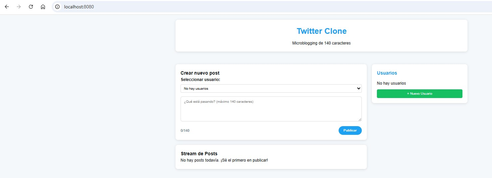
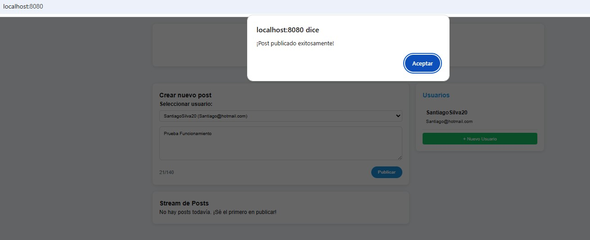
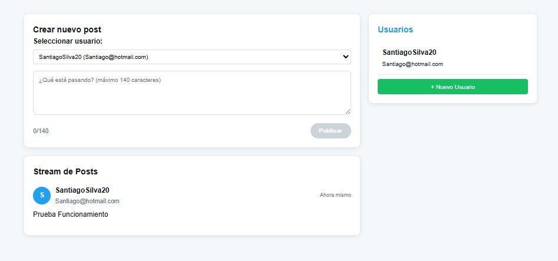
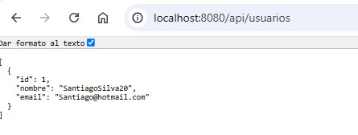
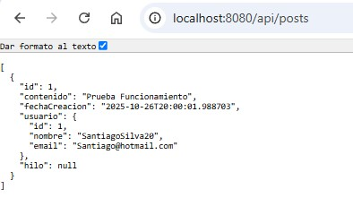
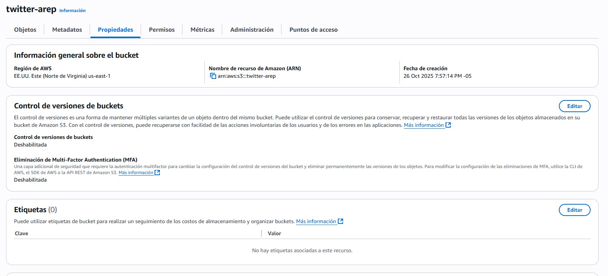
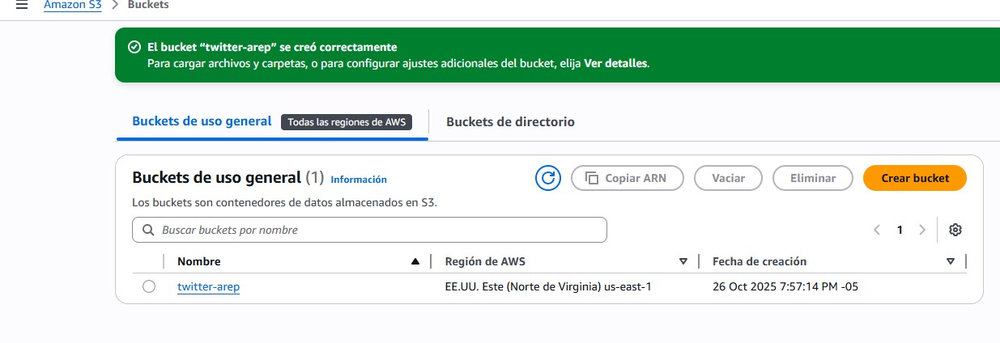
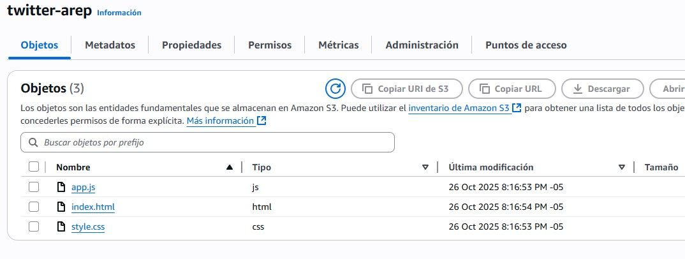
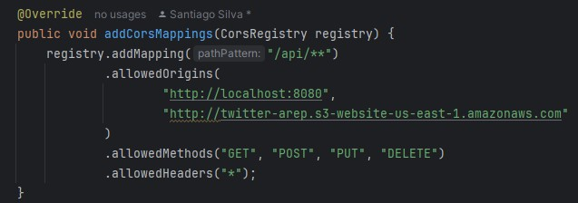
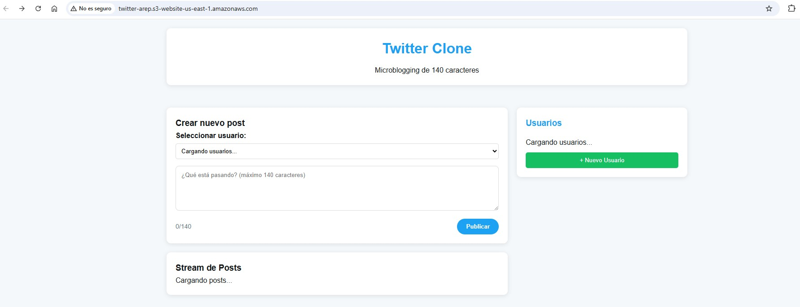

# Tarea de Microservicios - Twitter Clone

## Descripción

Implementación de una plataforma de microblogging similar a Twitter que evoluciona de una arquitectura monolítica a una basada en microservicios, utilizando Spring Boot para el backend y JavaScript para el frontend.

## 👥 Integrantes del Grupo

* Diego Macia
* Daniel Aldana
* Santiago Silva

## Estructura del Proyecto

### Backend - Spring Boot Monolito

```
src/
├── main/
│   ├── java/
│   │   └── com/
│   │       └── twitter/
│   │           ├── TwitterApp.java
│   │           ├── config/
│   │           │   └── WebConfig.java
│   │           ├── controller/
│   │           │   ├── PostController.java
│   │           │   ├── ThreadController.java
│   │           │   └── UserController.java
│   │           ├── model/
│   │           │   ├── Post.java
│   │           │   ├── Thread.java
│   │           │   └── User.java
│   │           ├── repository/
│   │           │   ├── PostRepository.java
│   │           │   ├── ThreadRepository.java
│   │           │   └── UserRepository.java
│   │           └── service/
│   │               ├── PostService.java
│   │               ├── ThreadService.java
│   │               └── UserService.java
│   └── resources/
│       └── static/
│           ├── css/
│           │   └── style.css
│           ├── js/
│           │   └── app.js
│           └── index.html
```

### Frontend - Aplicación JavaScript
```
resources/static/
├── css/
│   └── style.css
├── js/
│   └── app.js
└── index.html
```

Visualizacion FrontEnd: 



## Componentes Desarrollados: 

### Backend (Spring Boot)

**Entidades Implementadas:**
* User: Gestión de usuarios del sistema
* Post: Publicaciones de 140 caracteres

**Controladores:**
* UserController: CRUD de usuarios (`/api/usuarios`)
* PostController: Gestión de posts (`/api/posts`)
* ThreadController: Manejo de hilos (`/api/threads`)

**Servicios:**
* UserService: Lógica de negocio para usuarios
* PostService: Gestión y validación de posts

### 🎨 Frontend (JavaScript Vanilla)

**Funcionalidades:**
* Interfaz de usuario tipo Twitter
* Creación de posts con límite de 140 caracteres
* Permite crear, acceder a distintos usuarios y ver los post publicados recientemente


## API Endpoints

### Usuarios
* `GET /api/usuarios` - Listar todos los usuarios
* `POST /api/usuarios` - Crear nuevo usuario

### Posts
* `GET /api/posts` - Obtener stream de posts
* `POST /api/posts` - Crear nuevo post

## Prueba de Funcionamiento

### 1. Creación de Usuario
Se creó un usuario de prueba con las siguientes credenciales:
* **Username:** SantiagoSilva20
* **Email:** Santiago@hotmail.com



### 2. Publicación de Post
Con el usuario  seleccionado, se creó un post con el contenido: **"Prueba Funcionamiento"**



### 3. Verificación mediante API

#### Endpoint `/api/usuarios`
Se verificó que el usuario fue creado correctamente accediendo al endpoint `GET /api/usuarios`:



#### Endpoint `/api/posts`
Se verificó que el post fue guardado correctamente accediendo al endpoint `GET /api/posts`:



## Despliegue en AWS S3

### Configuración del Bucket S3

#### 1. Creación del Bucket
Se creó un bucket de S3 con el nombre `twitter-arep` para alojar el frontend de la aplicación.



#### 2. Bucket Creado
Confirmación del bucket creado exitosamente:



#### 3. Carga de Archivos
Se subieron los siguientes archivos al bucket:

* `index.html`
* `app.js`
* `style.css`



#### 4. Configuración de Static Website Hosting

Se configuró el bucket para alojar un sitio web estático, obteniendo el siguiente endpoint:

```
http://twitter-arep.s3-website-us-east-1.amazonaws.com
```

#### 5. Configuración de CORS
Se configuró CORS en el bucket para permitir las peticiones desde el frontend hacia el backend:



#### 6. Aplicación Desplegada
Accediendo al endpoint se puede visualizar la aplicación funcionando correctamente:

